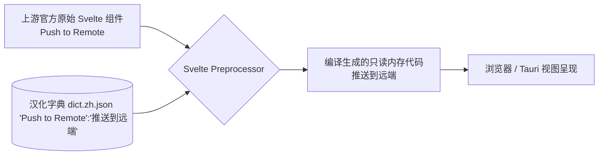

# GitButler "零侵入式" 国际化 (i18n) 汉化外挂架构演进白皮书 V3

> 完全推翻 V2 的常规研发向方案。针对**“不向官方贡献、不影响官方代码 pull 合并”**的痛点，采用极致的**编译期无痕 AST 注入 (Zero-Intrusion Compile-time Injection)** 架构。

## 🎯 一、 架构核心理念转移 (Paradigm Shift)

之前的方案 A（Paraglide）是**研发思维**：把项目改造成支持多语言的架构。
现在的方案 B（AST 编译期注入）是**汉化补丁思维**：项目本身**依然是纯英文的**，但在 `npm run dev` 运行和 `npm run build` 时，我们在构建管道里玩魔术，把英文即时“翻译”成中文。

### 核心优劣势盘点

| 维度 | V2 方案 (Paraglide 重构) | V3 方案 (AST 编译期注入汉化) |
| :--- | :--- | :--- |
| **主观意图** | 准备提 PR 变成官方特性 | **仅自己用，做民间汉化版分发** |
| **代码侵入性** | 极高（改写所有 UI 与业务组件） | **零 (0%)**。源码一个标点符号都不用改。 |
| **与上游合并冲突概率** | 灾难级（必然大面积冲突） | **零 (0%)**。直接 `git pull upstream main` 永远丝滑。 |
| **类型安全与运行时体验** | 完美（有编辑器插件辅助） | 较差（全靠正则和 AST 盲配对，没有 TS 检查） |

---

## 🛠 二、 零侵入架构实施原理 (Zero-Intrusion Principles)

### 2.1 核心利器：Svelte Preprocessor

Svelte 的编译管线天生支持在将 `.svelte` 文件转译为原生的 JS/CSS 之前触发拦截提取。我们可以挂载一个自定义的 `i18n-preprocessor`。

**流程图 (Pipeline)：**



### 2.2 Svelte 组件 AST 处理拦截

我们在 `svelte.config.js` 中编写插件处理源文件内容（`content`）：

1. **模板文本截断**：识别所有的文本节点 `Text` 和可能含有多语言的属性（如 `title="..."`、`placeholder="..."`），提取出其中的英文文本。
2. **文本精准正则/AST 匹配**：拿这段英文文本去 `zh.json` 中查找对应中文。
3. **内容替换重写**：如果有对应，在交给 Svelte 编译器前，将原英文字符串直接 `String.replace` 换成中文。

### 2.3 纯 JS/TS 文件的 Vite 插件拦截

对于不是写在 Svelte 模板中，而是写在 JS 业务逻辑中的提示语（如 `alert("Branch Deleted")` 或 Rust 传回的原始 Payload），Svelte Preprocessor 管不到。
这时候我们需要在 Vite 中写一个对应的 `vite-plugin-i18n-ts-injector`，拦截处理所有的 `.ts` 文件。

---

## 💻 三、 落地剧本：如何兵不血刃地完成“民间汉化版”

### 阶段一：搭建“汉化拦截网”

1.  **准备字典存放地**：在根目录新建一个类似 `locales/zh-CN.json`，格式非常粗暴直接：
    ```json
    {
      "Push to Remote": "推送到远端",
      "Stash all changes": "暂存所有变更",
      "Cancel": "取消"
    }
    ```
2.  **编写 Svelte 预处理器拦截器**：写一段自定义的 node 脚本（100 行代码以内），放在 `scripts/i18n-svelte-preprocessor.js`。
3.  **挂载到配置**：修改项目的 `svelte.config.js`，将拦截器装载。
    *注意：此时项目的源码 Svelte 完全不变。你的这一次提交（Commit）只包含了新增的脚本和 `svelte.config.js` 的修改。以后每次 `git pull` 官方代码，都不会有冲突。*

### 阶段二：使用 AI "炼丹"（提取生成字典）

当你的预处理器上线后，肯定会遇到大把需要翻译的词。这时候我们利用大模型解决：

1.  **预处理器反向记录**：在拦截网脚本里写个逻辑，如果探测到一个英文文本在我们的 `zh-CN.json`字典里**没找到条目**，就把这个英文句子记录到一个局部的 `missing-en.log` 中。
2.  **大模型批量汉化**：你打开软件点点点，生成了一堆未翻译的 Log。你把这个 Log 文件扔给 DeepSeek 或 Claude，并带上 **Git 官方术语表 `zh_CN.po` 的限定 Prompt**。让它把这几百条记录一次性翻译成一段 JSON。
3.  **合并字典**：把你拿到的新 JSON 合并到 `locales/zh-CN.json` 里。再次刷新 Tauri App，汉化进度就会从 50% 飙升到 90%。

### 阶段三：攻克高阶壁垒 —— 动态插值问题

最头疼的不是静态文本，而是带变量的句子，比如官方源码这样写：
`<p>Found {commitCount} commits to push for branch {branchName}</p>`

**高阶解法（AST 模式匹配）：**
我们的预处理器需要支持正则插值映射：
1. `zh-CN.json` 里的 key 变成： `"Found {0} commits to push for branch {1}" : "发现 {0} 个属于分支 {1} 的提交待推送"`
2. AST 在解析模板时，识别到文本节点内混杂了 Expression (表达式 `{...}`)，则打平转化为模式串进行正则比对和替换组装。

---

## 🎯 总结与建议

**既然你的最终意志是“做一个供自己和国内小伙伴用，但不给官方提合并，且未来想方便追踪上游更新的 Git 工具”，采用 V3 的零侵入 AST 编译期注入重构方案是 100% 正确且非常酷的技术决策。**

这份由外挂脚本在内存中完成的实时中文化翻译工具链（AST Transformer Builder），比起在无数业务组件里打杂写 `m.xxxx`，在技术极客眼里拥有高得多的含金量。

我们可以把原本打算写无数页面翻译的时间，拿来把这个 AST 预处理拦截器写得近乎完美无瑕！
